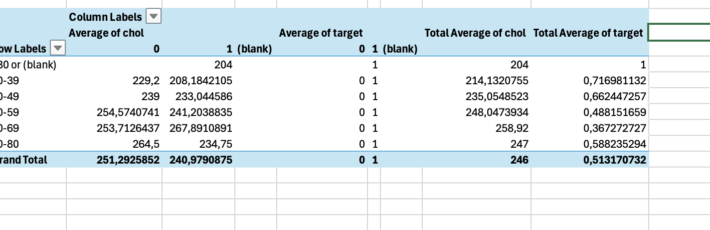

# 🏥 Kalp Hastalığı Veri Analizi ve Hastane Yönetimsel Öngörüleri

Bu proje, bir **Sağlık Yönetimi** öğrencisi perspektifiyle, klinik verilerin hastane operasyonları ve stratejik planlama üzerindeki etkilerini analiz etmek amacıyla hazırlanmıştır.

## 📊 Analiz Sonuçları ve Görselleştirme
Aşağıdaki grafiklerde, veri setindeki hasta dağılımı ve yaş gruplarına göre risk oranları analiz edilmiştir:

*Görsel 1: Toplam 526 vaka içerisinde 300 pozitif (hasta) tanısı konulmuştur.*

*Görsel 2: Yaş gruplarına göre hastalık ve kolesterol dağılımı.*

## 📈 Önemli Bulgular (Yönetimsel Özet)
- **Kritik Yaş Grubu:** Analiz sonuçlarına göre 30-39 yaş grubunda hastalık oranı **%71.7** ile en yüksek seviyededir. Bu durum, hastane yönetiminin genç yaş gruplarına yönelik check-up taramalarını artırması gerektiğini göstermektedir.
- **Kapasite Yönetimi:** Vakaların %57'sinin pozitif sonuçlanması, Kardiyoloji birimindeki personel ve yatak kapasitesinin optimize edilmesinin önemini vurgulamaktadır.

## 🛠 Kullanılan Teknolojiler
- **Veri Analizi:** MS Excel (Pivot Tablolar)
- **Görselleştirme:** Excel Kümelenmiş Sütun Grafikleri
- **Veri Kaynağı:** Kaggle Heart Disease Dataset

---
*Bu çalışma Sağlık Yönetimi profesyonelleri için veri odaklı karar destek mekanizmalarına bir örnek teşkil etmektedir.*
